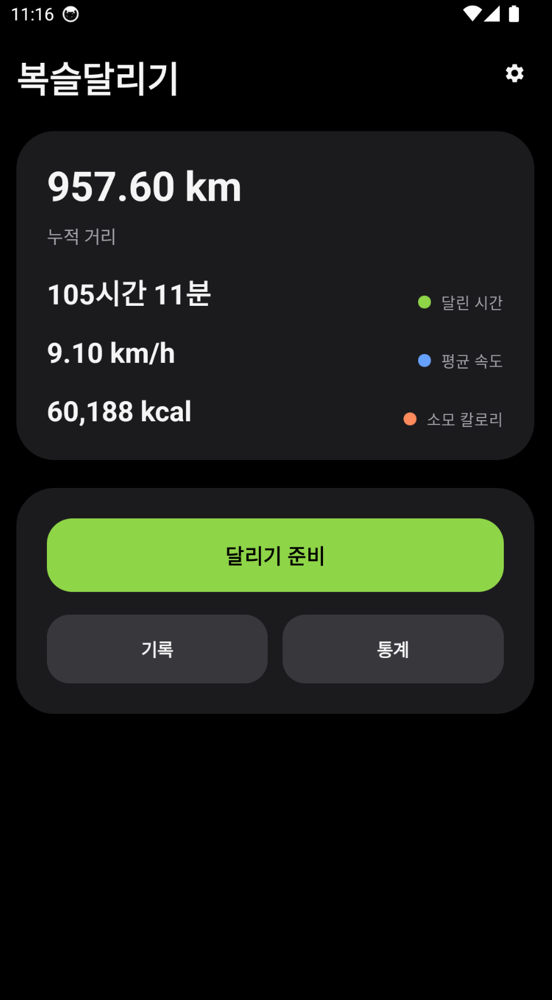
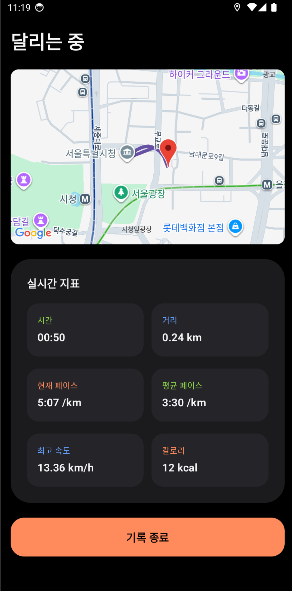
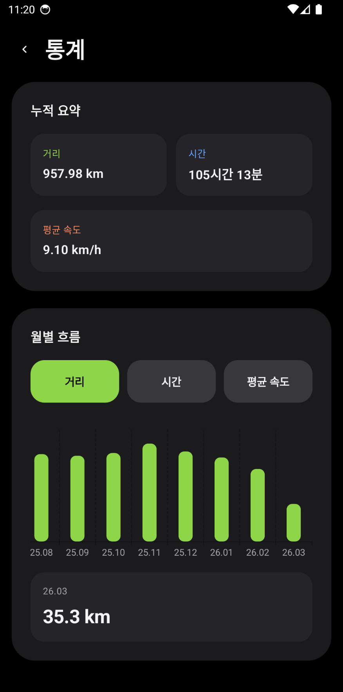

# 복슬달리기

복슬달리기는 개인용 러닝 기록 앱입니다.
러닝 경로, 시간, 거리, 페이스를 기록하고 누적 통계와 월별 흐름을 확인할 수 있으며, 전체 데이터를 JSON 파일로 내보내고 다시 가져올 수 있습니다.

100% 바이브코딩(Codex)으로 개발했습니다.

## 주요 기능

- GPS 기반 러닝 기록과 지도 경로 저장
- 러닝 준비 화면과 실시간 러닝 화면 제공
- 기록 목록/상세 조회와 삭제
- 누적 거리, 시간, 평균 속도와 월별 통계 확인
- 전체 데이터 내보내기/가져오기
- 오프라인 상태에서도 핵심 기록 기능 유지

## 빠른 실행

권장 환경:

- JDK 17
- Android SDK / Platform Tools (`adb`)
- Gradle Wrapper 사용

Android Studio에서 `app` 실행이 가장 간단합니다.

CLI로 바로 설치/실행하려면:

```bash
./gradlew installDebug
adb shell am start -n com.boksl.running/.MainActivity
```

## 문서

- 요구사항: [docs/PRD.md](./docs/PRD.md)
- 사용자 흐름: [docs/storyboard.md](./docs/storyboard.md)
- 구현 계획: [docs/implementation-plan.md](./docs/implementation-plan.md)
- 기술 스택: [docs/tech-stack.md](./docs/tech-stack.md)
- 로컬 환경 설정: [docs/dev-setup.md](./docs/dev-setup.md)
- 상세 명령어: [docs/commands.md](./docs/commands.md)

## 스크린샷






